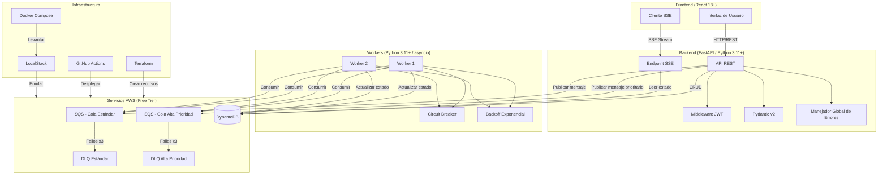
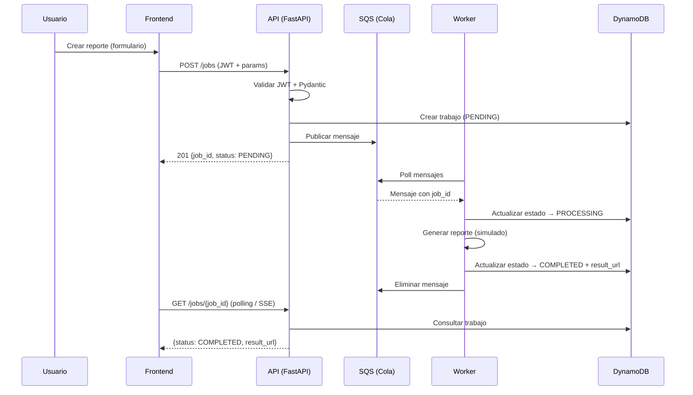
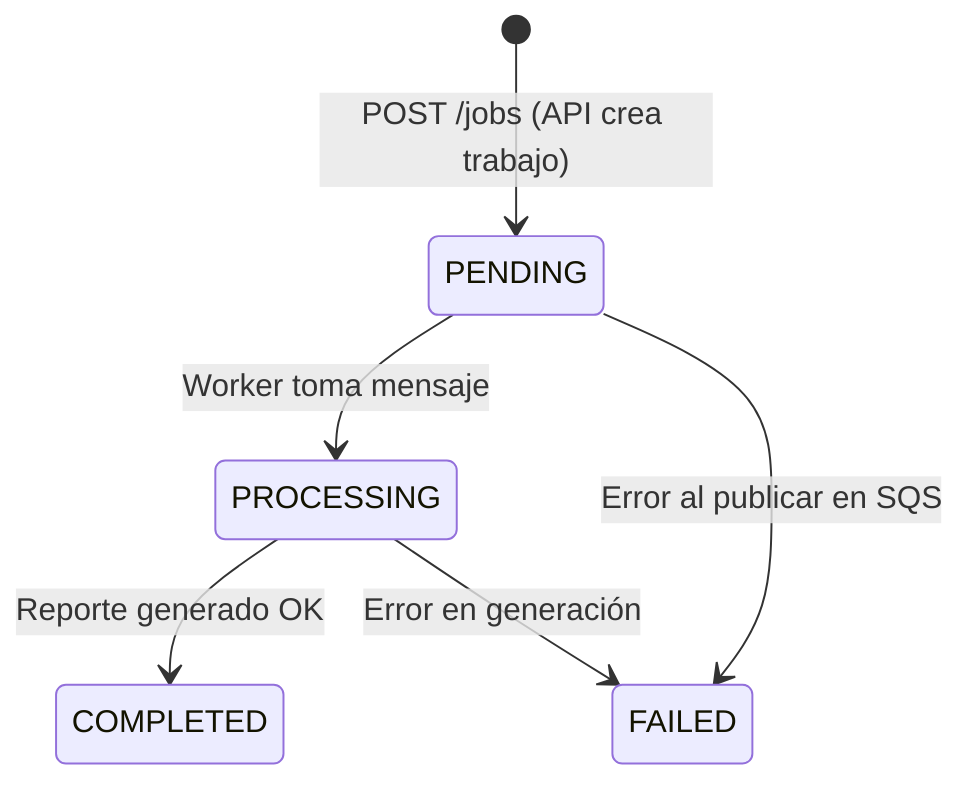
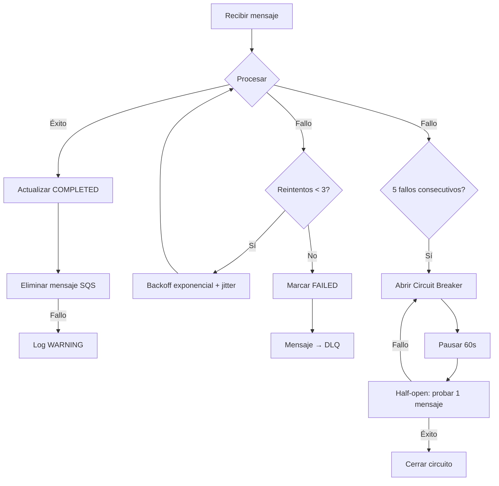

# Documento de Diseño — Sistema de Procesamiento Asíncrono de Reportes

## Resumen General

Este documento describe el diseño técnico del sistema de procesamiento asíncrono de reportes para una plataforma SaaS de analítica. El sistema permite a usuarios autenticados solicitar reportes que se procesan en segundo plano mediante una arquitectura basada en colas de mensajes (AWS SQS) y workers concurrentes, con persistencia en AWS DynamoDB.

La arquitectura sigue un patrón productor-consumidor desacoplado: el API (FastAPI) actúa como productor publicando trabajos en SQS, y los workers actúan como consumidores procesando los mensajes de forma asíncrona. El frontend (React) proporciona la interfaz visual para interactuar con el sistema.

Decisiones clave:
- **AWS SQS** como cola de mensajes por su simplicidad, integración nativa con AWS y elegibilidad para el nivel gratuito (1M solicitudes/mes).
- **AWS DynamoDB** como base de datos por su modelo serverless, escalabilidad y nivel gratuito generoso (25 GB, 25 RCU/WCU).
- **FastAPI** por su soporte nativo de async/await, validación automática con Pydantic v2 y generación de documentación OpenAPI.
- **SSE (Server-Sent Events)** en lugar de WebSocket para notificaciones en tiempo real, por su simplicidad de implementación y compatibilidad nativa con HTTP.
- **LocalStack** para desarrollo local sin costos de AWS.
- **Terraform** como IaC para automatizar toda la infraestructura de producción.
- **JWT** para autenticación stateless compatible con arquitecturas distribuidas.

Todo el sistema opera dentro del nivel gratuito de AWS, garantizando cero cargos.

## Arquitectura

### Diagrama de Arquitectura General



### Flujo de Procesamiento



### Decisiones de Arquitectura

| Decisión | Opción Elegida | Justificación |
|----------|---------------|---------------|
| Cola de mensajes | AWS SQS | Serverless, 1M req/mes gratis, DLQ nativa, sin infraestructura que mantener |
| Base de datos | DynamoDB | Serverless, 25GB + 25 RCU/WCU gratis, GSI para consultas por usuario |
| Framework backend | FastAPI | Async nativo, Pydantic v2 integrado, OpenAPI automático |
| Autenticación | JWT (PyJWT) | Stateless, no requiere sesiones en servidor, simple de implementar |
| Notificaciones real-time | SSE | Unidireccional (servidor→cliente), HTTP nativo, reconexión automática con EventSource |
| IaC | Terraform | Declarativo, estado gestionado, amplio soporte AWS, comunidad activa |
| Dev local | LocalStack + Docker Compose | Emula SQS y DynamoDB sin costos, un solo comando para levantar todo |
| CI/CD | GitHub Actions | Integración nativa con GitHub, secretos seguros, gratis para repos públicos |
| Containerización | Docker multi-stage | Imágenes pequeñas, caché de capas, usuario no-root |
| Concurrencia workers | asyncio | Nativo en Python 3.11+, sin dependencias extra, ideal para I/O-bound |


## Componentes e Interfaces

### 1. API REST (FastAPI)

Servidor HTTP que expone los endpoints del sistema. Responsable de autenticación, validación, persistencia y publicación de mensajes en SQS.

**Endpoints:**

| Método | Ruta | Descripción | Auth | Req |
|--------|------|-------------|------|-----|
| POST | `/auth/register` | Registro de usuario | No | 4.6 |
| POST | `/auth/login` | Login, retorna JWT | No | 4.1, 4.2 |
| POST | `/jobs` | Crear trabajo de reporte | JWT | 1.1-1.5 |
| GET | `/jobs` | Listar trabajos paginados | JWT | 3.1-3.4 |
| GET | `/jobs/{job_id}` | Consultar estado de trabajo | JWT | 2.1-2.3 |
| GET | `/health` | Health check del sistema | No | 19.2 |
| GET | `/stream/jobs` | Stream SSE de actualizaciones | JWT | 17.1-17.2 |

**Módulos internos:**

```
backend/
├── app/
│   ├── main.py                 # Aplicación FastAPI, middleware, exception handlers
│   ├── config.py               # Configuración con Pydantic Settings
│   ├── dependencies.py         # Inyección de dependencias (DB, SQS clients)
│   ├── auth/
│   │   ├── router.py           # Endpoints /auth/*
│   │   ├── service.py          # Lógica de autenticación (hash, JWT)
│   │   ├── schemas.py          # Modelos Pydantic: LoginRequest, TokenResponse
│   │   └── middleware.py       # Middleware JWT para rutas protegidas
│   ├── jobs/
│   │   ├── router.py           # Endpoints /jobs/*
│   │   ├── service.py          # Lógica de negocio de trabajos
│   │   ├── schemas.py          # Modelos Pydantic: JobCreate, JobResponse, JobList
│   │   └── enums.py            # JobStatus enum (PENDING, PROCESSING, COMPLETED, FAILED)
│   ├── stream/
│   │   ├── router.py           # Endpoint SSE /stream/jobs
│   │   └── service.py          # Lógica de streaming SSE
│   ├── db/
│   │   ├── client.py           # Cliente DynamoDB (boto3)
│   │   └── repository.py       # Operaciones CRUD sobre la tabla de trabajos
│   ├── queue/
│   │   ├── client.py           # Cliente SQS (boto3)
│   │   └── publisher.py        # Publicación de mensajes en SQS
│   ├── observability/
│   │   ├── logging.py          # Configuración de logging JSON estructurado
│   │   └── metrics.py          # Métricas en memoria (contadores, promedios)
│   └── errors/
│       └── handlers.py         # Exception handlers globales
├── Dockerfile
├── requirements.txt
└── tests/
    ├── unit/
    ├── integration/
    └── conftest.py
```

**Interfaces clave del API:**

```python
# POST /jobs - Request
class JobCreateRequest(BaseModel):
    report_type: Literal["sales", "inventory", "analytics"]
    date_range: DateRange
    format: Literal["csv", "pdf", "json"]
    priority: Literal["standard", "high"] = "standard"

class DateRange(BaseModel):
    start_date: date
    end_date: date

    @model_validator(mode="after")
    def validate_range(self) -> "DateRange":
        if self.start_date > self.end_date:
            raise ValueError("start_date must be before end_date")
        return self

# POST /jobs - Response (201)
class JobCreateResponse(BaseModel):
    job_id: str
    status: Literal["PENDING"]

# GET /jobs/{job_id} - Response (200)
class JobResponse(BaseModel):
    job_id: str
    user_id: str
    status: JobStatus
    report_type: str
    created_at: datetime
    updated_at: datetime
    result_url: Optional[str] = None

# GET /jobs - Response (200)
class JobListResponse(BaseModel):
    items: list[JobResponse]
    total: int
    page: int
    next_cursor: Optional[str] = None

# POST /auth/login - Request
class LoginRequest(BaseModel):
    username: str
    password: str

# POST /auth/login - Response (200)
class TokenResponse(BaseModel):
    access_token: str
    token_type: Literal["bearer"] = "bearer"

# POST /auth/register - Request
class RegisterRequest(BaseModel):
    username: str = Field(min_length=3, max_length=50)
    password: str = Field(min_length=8)

# GET /health - Response
class HealthResponse(BaseModel):
    status: Literal["healthy", "unhealthy"]
    dynamodb: Literal["ok", "error"]
    sqs: Literal["ok", "error"]

# Error Response (uniforme)
class ErrorResponse(BaseModel):
    detail: str
    field: Optional[str] = None
```

### 2. Worker

Proceso independiente que consume mensajes de SQS y ejecuta la generación de reportes.

```
worker/
├── app/
│   ├── main.py                 # Entry point del worker
│   ├── config.py               # Configuración
│   ├── consumer.py             # Consumidor SQS con polling
│   ├── processor.py            # Lógica de generación de reportes (simulada)
│   ├── circuit_breaker.py      # Implementación del patrón Circuit Breaker
│   ├── retry.py                # Backoff exponencial con jitter
│   ├── db/
│   │   ├── client.py           # Cliente DynamoDB compartido
│   │   └── repository.py       # Operaciones de actualización de estado
│   └── observability/
│       └── logging.py          # Logging JSON estructurado
├── Dockerfile
├── requirements.txt
└── tests/
    ├── unit/
    └── conftest.py
```

**Interfaces clave del Worker:**

```python
# Mensaje SQS
class SQSJobMessage(BaseModel):
    job_id: str
    user_id: str
    report_type: str
    date_range: dict  # {"start_date": "...", "end_date": "..."}
    format: str
    priority: str

# Circuit Breaker
class CircuitBreaker:
    state: Literal["closed", "open", "half_open"]
    failure_count: int
    failure_threshold: int = 5
    recovery_timeout: int = 60  # segundos

    async def call(self, func: Callable, *args) -> Any: ...
    def record_success(self) -> None: ...
    def record_failure(self) -> None: ...

# Retry con backoff exponencial
async def retry_with_backoff(
    func: Callable,
    max_retries: int = 3,
    base_delay: float = 1.0,
    jitter_ms: int = 500
) -> Any: ...
```

### 3. Frontend (React)

```
frontend/
├── src/
│   ├── App.tsx
│   ├── main.tsx
│   ├── api/
│   │   └── client.ts           # Cliente HTTP (fetch/axios) con JWT
│   ├── hooks/
│   │   ├── useAuth.ts          # Hook de autenticación
│   │   ├── useJobs.ts          # Hook para CRUD de trabajos
│   │   └── useSSE.ts           # Hook para conexión SSE con fallback a polling
│   ├── components/
│   │   ├── LoginForm.tsx
│   │   ├── JobForm.tsx         # Formulario de creación de reporte
│   │   ├── JobList.tsx         # Lista de trabajos con badges de estado
│   │   ├── JobStatusBadge.tsx  # Badge de color por estado
│   │   ├── Toast.tsx           # Componente de notificaciones
│   │   └── Layout.tsx          # Layout responsive
│   ├── pages/
│   │   ├── LoginPage.tsx
│   │   └── DashboardPage.tsx
│   └── types/
│       └── index.ts            # Tipos TypeScript
├── Dockerfile
├── package.json
└── vite.config.ts
```

**Interfaces clave del Frontend:**

```typescript
// Tipos principales
interface Job {
  job_id: string;
  user_id: string;
  status: "PENDING" | "PROCESSING" | "COMPLETED" | "FAILED";
  report_type: string;
  created_at: string;
  updated_at: string;
  result_url: string | null;
}

interface JobCreatePayload {
  report_type: "sales" | "inventory" | "analytics";
  date_range: { start_date: string; end_date: string };
  format: "csv" | "pdf" | "json";
  priority?: "standard" | "high";
}

// Colores de badges por estado (Req 9.4)
const STATUS_COLORS: Record<Job["status"], string> = {
  PENDING: "yellow",
  PROCESSING: "blue",
  COMPLETED: "green",
  FAILED: "red",
};

// Hook SSE con fallback a polling
function useSSE(url: string, options: {
  onMessage: (event: SSEJobEvent) => void;
  fallbackPollingInterval: number; // 5000ms
  reconnectTimeout: number;       // 30000ms
}): { connected: boolean; usingFallback: boolean };
```

### 4. Infraestructura

```
infra/
├── terraform/
│   ├── main.tf                 # Provider AWS, backend state
│   ├── variables.tf            # Variables de configuración
│   ├── outputs.tf              # URLs y ARNs de salida
│   ├── dynamodb.tf             # Tabla + GSI
│   ├── sqs.tf                  # Colas estándar + prioridad + DLQs
│   ├── iam.tf                  # Roles y políticas
│   └── compute.tf              # ECS/Lambda o EC2 free tier
├── localstack/
│   └── init-aws.sh             # Script de inicialización de recursos LocalStack
├── docker-compose.yml          # Orquestación local completa
├── .env.example                # Variables de entorno documentadas
└── .github/
    └── workflows/
        └── deploy.yml          # Pipeline CI/CD
```

## Modelos de Datos

### Tabla DynamoDB: `jobs`

| Campo | Tipo | Descripción | Clave |
|-------|------|-------------|-------|
| `job_id` | String (UUID v4) | Identificador único del trabajo | Partition Key |
| `user_id` | String | ID del usuario propietario | GSI PK |
| `status` | String | Estado: PENDING, PROCESSING, COMPLETED, FAILED | — |
| `report_type` | String | Tipo de reporte: sales, inventory, analytics | — |
| `format` | String | Formato de salida: csv, pdf, json | — |
| `priority` | String | Prioridad: standard, high | — |
| `date_range` | Map | `{start_date: String, end_date: String}` | — |
| `created_at` | String (ISO 8601) | Fecha de creación | GSI SK |
| `updated_at` | String (ISO 8601) | Fecha de última actualización | — |
| `result_url` | String (nullable) | URL del reporte generado | — |
| `error_message` | String (nullable) | Mensaje de error si falló | — |

**Índice Secundario Global (GSI): `user-jobs-index`**
- Partition Key: `user_id`
- Sort Key: `created_at`
- Proyección: ALL (todos los atributos)

Este GSI permite consultas eficientes de "todos los trabajos de un usuario ordenados por fecha de creación" (Req 3.1, 8.2).

### Tabla DynamoDB: `users`

| Campo | Tipo | Descripción | Clave |
|-------|------|-------------|-------|
| `user_id` | String (UUID v4) | Identificador único del usuario | Partition Key |
| `username` | String | Nombre de usuario único | GSI PK |
| `password_hash` | String | Hash bcrypt de la contraseña | — |
| `created_at` | String (ISO 8601) | Fecha de registro | — |

**Índice Secundario Global (GSI): `username-index`**
- Partition Key: `username`
- Proyección: ALL

### Mensaje SQS

```json
{
  "job_id": "550e8400-e29b-41d4-a716-446655440000",
  "user_id": "user-123",
  "report_type": "sales",
  "date_range": {
    "start_date": "2024-01-01",
    "end_date": "2024-01-31"
  },
  "format": "csv",
  "priority": "standard"
}
```

### Configuración de Colas SQS

| Cola | Visibility Timeout | Retention | Max Receives (→DLQ) |
|------|-------------------|-----------|---------------------|
| `reports-queue-standard` | 30s | 4 días | 3 |
| `reports-queue-high` | 30s | 4 días | 3 |
| `reports-dlq-standard` | 30s | 14 días | — |
| `reports-dlq-high` | 30s | 14 días | — |

### Diagrama de Estados del Trabajo



### Token JWT

```json
{
  "sub": "user-id-uuid",
  "username": "nombre_usuario",
  "exp": 1700000000,
  "iat": 1699996400
}
```

Firmado con HS256 y un secreto configurable via variable de entorno `JWT_SECRET`.

### Configuración del Nivel Gratuito AWS

| Servicio | Límite Free Tier | Uso Estimado |
|----------|-----------------|--------------|
| DynamoDB | 25 GB, 25 RCU, 25 WCU | < 1 GB, < 5 RCU/WCU |
| SQS | 1M solicitudes/mes | < 10K solicitudes/mes |
| EC2 (t2.micro) | 750 hrs/mes (12 meses) | 1 instancia 24/7 |
| ECR | 500 MB almacenamiento | < 200 MB (2 imágenes) |
| CloudWatch | 10 métricas, 5 GB logs | Mínimo uso |

**Estrategia de despliegue en producción (Free Tier):**
- Una instancia EC2 t2.micro ejecutando Docker Compose con API + Worker + Frontend (Nginx)
- DynamoDB y SQS como servicios gestionados
- Terraform crea todo: VPC, Security Group, EC2, DynamoDB, SQS, IAM roles
- GitHub Actions despliega via SSH a la instancia EC2

Esta estrategia mantiene todo dentro del free tier al usar una sola instancia EC2 que ejecuta todos los contenedores, evitando servicios como ECS Fargate o Lambda que podrían generar cargos adicionales.

## Propiedades de Correctitud

*Una propiedad es una característica o comportamiento que debe mantenerse verdadero en todas las ejecuciones válidas de un sistema — esencialmente, una declaración formal sobre lo que el sistema debe hacer. Las propiedades sirven como puente entre especificaciones legibles por humanos y garantías de correctitud verificables por máquinas.*

### Propiedad 1: Creación de trabajo válida retorna PENDING

*Para cualquier* combinación válida de report_type, date_range y format enviada por un usuario autenticado a POST /jobs, el sistema debe crear un trabajo con estado PENDING y retornar un objeto JSON con job_id (UUID válido) y status "PENDING" con código HTTP 201.

**Valida: Requisitos 1.1**

### Propiedad 2: Entrada inválida retorna 422 con detalle del campo

*Para cualquier* solicitud a cualquier endpoint del API con datos que violen las reglas de validación (campos faltantes, tipos incorrectos, rangos de fecha inválidos), el sistema debe retornar HTTP 422 con un JSON que incluya el nombre del campo afectado y una descripción del error.

**Valida: Requisitos 1.2, 5.2**

### Propiedad 3: Creación de trabajo publica mensaje SQS completo

*Para cualquier* trabajo creado exitosamente, debe existir un mensaje en la cola SQS correspondiente que contenga todos los campos requeridos: job_id, user_id, report_type, date_range y format, y estos valores deben coincidir con los del trabajo creado.

**Valida: Requisitos 1.3, 6.1**

### Propiedad 4: Persistencia completa en DynamoDB (round trip)

*Para cualquier* trabajo creado, el registro en DynamoDB debe contener todos los campos requeridos (job_id, user_id, status, report_type, created_at, updated_at, result_url), y al consultar el trabajo por job_id se deben obtener los mismos valores que se enviaron en la creación.

**Valida: Requisitos 1.4, 8.1**

### Propiedad 5: Consulta de trabajo retorna estado completo para el propietario

*Para cualquier* trabajo existente consultado por su propietario via GET /jobs/{job_id}, el sistema debe retornar HTTP 200 con todos los campos del trabajo (job_id, user_id, status, report_type, created_at, updated_at, result_url).

**Valida: Requisitos 2.1**

### Propiedad 6: Aislamiento de datos entre usuarios

*Para cualquier* par de usuarios A y B, y cualquier trabajo perteneciente al usuario A, cuando el usuario B intenta consultar ese trabajo via GET /jobs/{job_id}, el sistema debe retornar HTTP 403.

**Valida: Requisitos 2.2**

### Propiedad 7: Listado de trabajos contiene exclusivamente trabajos del usuario

*Para cualquier* usuario autenticado, la respuesta de GET /jobs debe contener únicamente trabajos donde user_id coincida con el ID del usuario autenticado. Ningún trabajo de otro usuario debe aparecer en la lista.

**Valida: Requisitos 3.1**

### Propiedad 8: Paginación correcta con metadatos

*Para cualquier* usuario con N trabajos, la respuesta paginada de GET /jobs debe: retornar como máximo el tamaño de página configurado (mínimo 20 por defecto), incluir metadatos de paginación (total, página actual, referencia a siguiente página), y al recorrer todas las páginas secuencialmente se deben obtener exactamente N trabajos sin duplicados ni omisiones.

**Valida: Requisitos 3.2, 3.3, 3.4**

### Propiedad 9: Login válido retorna JWT firmado

*Para cualquier* usuario registrado que envíe credenciales correctas a POST /auth/login, el sistema debe retornar un token JWT válido que: sea decodificable con la clave de firma del sistema, contenga el user_id correcto en el campo "sub", y tenga una fecha de expiración futura.

**Valida: Requisitos 4.1**

### Propiedad 10: Autenticación rechaza tokens inválidos

*Para cualquier* solicitud a un endpoint protegido que incluya un token JWT expirado, con firma inválida, malformado, o sin token, el sistema debe retornar HTTP 401.

**Valida: Requisitos 4.2, 4.3, 4.4**

### Propiedad 11: Extracción de user_id del JWT (round trip)

*Para cualquier* usuario registrado, el user_id codificado en el JWT al hacer login debe ser idéntico al user_id extraído por el middleware de autenticación al usar ese token en una solicitud protegida.

**Valida: Requisitos 4.5**

### Propiedad 12: Transiciones de estado del Worker

*Para cualquier* trabajo procesado por el worker, el estado debe transicionar de PENDING a PROCESSING antes de iniciar la generación, y luego a COMPLETED (con result_url no nulo) si la generación es exitosa, o a FAILED (con error_message no nulo) si falla.

**Valida: Requisitos 7.2, 7.3, 7.4**

### Propiedad 13: Mensaje SQS eliminado tras procesamiento exitoso

*Para cualquier* mensaje procesado exitosamente por el worker, el mensaje debe ser eliminado de la cola SQS y no debe ser visible para otros consumidores.

**Valida: Requisitos 7.6**

### Propiedad 14: updated_at se actualiza en cada modificación

*Para cualquier* trabajo que sea actualizado (cambio de estado, asignación de result_url), el campo updated_at debe tener un valor posterior al updated_at previo a la actualización.

**Valida: Requisitos 8.3**

### Propiedad 15: Enrutamiento de mensajes por prioridad

*Para cualquier* trabajo creado, si la prioridad es "high" el mensaje debe publicarse en la cola de alta prioridad, y si la prioridad es "standard" o no se especifica, el mensaje debe publicarse en la cola estándar.

**Valida: Requisitos 15.1, 15.2**

### Propiedad 16: Consumo prioritario de colas

*Para cualquier* estado donde ambas colas (alta prioridad y estándar) tengan mensajes disponibles, el worker debe consumir todos los mensajes de la cola de alta prioridad antes de consumir mensajes de la cola estándar.

**Valida: Requisitos 15.3**

### Propiedad 17: Circuit Breaker se abre tras fallos consecutivos

*Para cualquier* secuencia de 5 o más fallos consecutivos en el procesamiento de mensajes, el circuit breaker debe transicionar al estado "open" y rechazar nuevos mensajes durante el período de recuperación (60 segundos).

**Valida: Requisitos 16.1, 16.2**

### Propiedad 18: Circuit Breaker — transición half-open y recuperación

*Para cualquier* circuit breaker en estado "open", después de que expire el período de recuperación (60 segundos), debe transicionar a "half-open". Si el siguiente mensaje se procesa exitosamente, debe cerrar el circuito. Si falla, debe reabrir el circuito por otro período de 60 segundos.

**Valida: Requisitos 16.3, 16.4, 16.5**

### Propiedad 19: Eventos SSE emitidos en cambios de estado

*Para cualquier* cambio de estado de un trabajo, el sistema debe emitir un evento SSE al usuario propietario que contenga job_id, el nuevo status y updated_at.

**Valida: Requisitos 17.2**

### Propiedad 20: Backoff exponencial con jitter en reintentos

*Para cualquier* fallo en el procesamiento de un mensaje, los reintentos deben seguir intervalos exponenciales (base 1s, 2s, 4s) con jitter aleatorio de ±500ms, resultando en delays reales dentro de los rangos [0.5s, 1.5s], [1.5s, 2.5s], [3.5s, 4.5s].

**Valida: Requisitos 18.1, 18.3**

### Propiedad 21: Agotamiento de reintentos marca trabajo como FAILED

*Para cualquier* mensaje que falle en los 3 reintentos, el worker debe marcar el trabajo como FAILED en DynamoDB y permitir que el mensaje sea enviado a la DLQ.

**Valida: Requisitos 18.2**

### Propiedad 22: Logging JSON estructurado con campos requeridos

*Para cualquier* entrada de log emitida por el API o el Worker, debe ser JSON válido que contenga los campos: timestamp (ISO 8601), level, message y request_id.

**Valida: Requisitos 19.1, 19.4**

### Propiedad 23: Métricas de ciclo de vida de trabajos

*Para cualquier* secuencia de operaciones de creación, completado y fallo de trabajos, las métricas del sistema deben reflejar correctamente los contadores de trabajos creados, completados y fallidos, y el tiempo promedio de procesamiento debe ser consistente con los tiempos reales observados.

**Valida: Requisitos 19.3**

### Propiedad 24: Validación del formulario frontend sin alert() nativo

*Para cualquier* entrada inválida en el formulario del frontend o error retornado por el API, el sistema debe mostrar un componente visual de error (toast, banner o mensaje inline) sin utilizar alert() nativo del navegador.

**Valida: Requisitos 9.3, 9.7**

### Propiedad 25: Badges de estado con colores correctos

*Para cualquier* trabajo mostrado en el frontend, el badge de estado debe usar el color correcto: amarillo para PENDING, azul para PROCESSING, verde para COMPLETED y rojo para FAILED.

**Valida: Requisitos 9.4**

## Manejo de Errores

### Estrategia General

El sistema implementa un manejo de errores en capas, donde cada componente tiene responsabilidades claras:

### API (FastAPI)

| Escenario | Código HTTP | Comportamiento |
|-----------|-------------|----------------|
| Validación de entrada falla (Pydantic) | 422 | Retorna campo afectado y descripción del error |
| Token JWT ausente, expirado o inválido | 401 | Retorna mensaje genérico de autenticación |
| Acceso a recurso de otro usuario | 403 | Retorna "Forbidden" sin revelar existencia del recurso |
| Recurso no encontrado | 404 | Retorna mensaje indicando que el recurso no existe |
| Fallo al publicar en SQS | 503 | Marca trabajo como FAILED, retorna "Service Unavailable" |
| Error interno no controlado | 500 | Retorna mensaje genérico, registra traceback completo en log |

**Implementación:**
- Exception handler global registrado en FastAPI via `app.add_exception_handler()`
- Todas las respuestas de error usan el modelo `ErrorResponse` uniforme
- Los errores internos nunca exponen detalles de implementación (stack traces, nombres de tablas, etc.)
- Cada error se registra con nivel ERROR en el log estructurado, incluyendo `request_id` para trazabilidad

### Worker

| Escenario | Comportamiento |
|-----------|----------------|
| Fallo en procesamiento de mensaje | Reintento con backoff exponencial (1s, 2s, 4s + jitter ±500ms) |
| Agotamiento de reintentos (3 intentos) | Marca trabajo como FAILED, mensaje va a DLQ |
| 5 fallos consecutivos | Circuit breaker se abre, pausa consumo 60s |
| Fallo al eliminar mensaje de SQS | Log WARNING, mensaje se reprocesará tras visibility timeout |
| Fallo al actualizar DynamoDB | Log ERROR, mensaje no se elimina de SQS (se reprocesará) |
| DynamoDB o SQS no disponible | Circuit breaker se activa tras 5 fallos |

**Flujo de error del Worker:**



### Frontend

| Escenario | Comportamiento |
|-----------|----------------|
| Error de validación del formulario | Mensajes inline junto a campos afectados |
| Error HTTP del API (4xx, 5xx) | Toast/banner visual, nunca alert() nativo |
| Pérdida de conexión SSE | Reconexión automática via EventSource, fallback a polling tras 30s |
| Token JWT expirado | Redirigir a pantalla de login |
| Error de red (fetch falla) | Toast con mensaje de error de conectividad |

### Startup y Conectividad

| Escenario | Comportamiento |
|-----------|----------------|
| LocalStack no disponible al iniciar API | Reintentar conexión durante 30s, luego fallar con mensaje descriptivo |
| DynamoDB no responde en health check | GET /health retorna 503 con `dynamodb: "error"` |
| SQS no responde en health check | GET /health retorna 503 con `sqs: "error"` |

## Estrategia de Testing

### Enfoque Dual: Pruebas Unitarias + Pruebas Basadas en Propiedades

El sistema utiliza un enfoque dual de testing:

- **Pruebas unitarias**: Verifican ejemplos específicos, casos borde y condiciones de error. Son útiles para escenarios concretos y puntos de integración.
- **Pruebas basadas en propiedades (PBT)**: Verifican propiedades universales que deben cumplirse para todas las entradas válidas. Proporcionan cobertura exhaustiva mediante generación aleatoria de inputs.

Ambos tipos son complementarios: las pruebas unitarias detectan bugs concretos, las pruebas de propiedades verifican correctitud general.

### Herramientas

| Herramienta | Uso |
|-------------|-----|
| **pytest** | Framework de testing principal (backend + worker) |
| **hypothesis** | Librería de property-based testing para Python |
| **pytest-asyncio** | Soporte para tests async |
| **pytest-cov** | Cobertura de código (mínimo 70%) |
| **moto** | Mock de servicios AWS (SQS, DynamoDB) para tests unitarios |
| **httpx** | Cliente HTTP async para tests de integración con FastAPI (TestClient) |
| **vitest** | Framework de testing para frontend (React) |
| **@testing-library/react** | Testing de componentes React |
| **fast-check** | Librería de property-based testing para TypeScript/JavaScript |

### Configuración de Pruebas Basadas en Propiedades

- Cada test de propiedad debe ejecutar un **mínimo de 100 iteraciones**
- Cada test debe incluir un comentario referenciando la propiedad del documento de diseño
- Formato del tag: **Feature: async-report-processing, Property {número}: {título}**
- Cada propiedad de correctitud debe ser implementada por un **único test de propiedad**

### Estructura de Tests

```
backend/tests/
├── unit/
│   ├── test_auth_service.py        # Login, registro, JWT
│   ├── test_job_service.py         # CRUD de trabajos
│   ├── test_job_validation.py      # Validación Pydantic
│   ├── test_queue_publisher.py     # Publicación SQS
│   ├── test_error_handlers.py      # Manejo centralizado de errores
│   └── test_health.py              # Health check
├── integration/
│   ├── test_job_flow.py            # Flujo completo: crear → procesar → completar
│   ├── test_auth_flow.py           # Registro → login → acceso protegido
│   └── test_failure_scenarios.py   # Simulación de fallos (SQS down, DDB down)
├── property/
│   ├── test_job_creation_props.py  # Propiedades 1-4
│   ├── test_auth_props.py          # Propiedades 9-11
│   ├── test_isolation_props.py     # Propiedades 6-8
│   ├── test_pagination_props.py    # Propiedad 8
│   └── test_validation_props.py    # Propiedad 2
└── conftest.py                     # Fixtures compartidos (moto mocks, test client)

worker/tests/
├── unit/
│   ├── test_consumer.py            # Consumo de mensajes
│   ├── test_processor.py           # Generación de reportes
│   ├── test_circuit_breaker.py     # Circuit breaker
│   └── test_retry.py               # Backoff exponencial
├── property/
│   ├── test_state_transition_props.py  # Propiedad 12
│   ├── test_circuit_breaker_props.py   # Propiedades 17-18
│   ├── test_retry_props.py             # Propiedades 20-21
│   └── test_priority_props.py          # Propiedades 15-16
└── conftest.py

frontend/src/__tests__/
├── components/
│   ├── JobForm.test.tsx
│   ├── JobList.test.tsx
│   ├── JobStatusBadge.test.tsx
│   └── Toast.test.tsx
├── hooks/
│   ├── useAuth.test.ts
│   ├── useJobs.test.ts
│   └── useSSE.test.ts
└── property/
    ├── statusBadge.prop.test.ts    # Propiedad 25
    └── validation.prop.test.ts     # Propiedad 24
```

### Ejemplo de Test de Propiedad (Python/Hypothesis)

```python
from hypothesis import given, strategies as st, settings

# Feature: async-report-processing, Property 2: Entrada inválida retorna 422 con detalle del campo
@settings(max_examples=100)
@given(
    report_type=st.text(min_size=0, max_size=50),
    start_date=st.text(),
    end_date=st.text(),
)
def test_invalid_input_returns_422_with_field_detail(
    client, auth_headers, report_type, start_date, end_date
):
    """Para cualquier solicitud con datos inválidos, el sistema retorna 422 con campo afectado."""
    payload = {
        "report_type": report_type,
        "date_range": {"start_date": start_date, "end_date": end_date},
        "format": "invalid_format",
    }
    response = client.post("/jobs", json=payload, headers=auth_headers)
    if response.status_code == 422:
        body = response.json()
        assert "detail" in body
```

### Ejemplo de Test de Propiedad (TypeScript/fast-check)

```typescript
import fc from "fast-check";

// Feature: async-report-processing, Property 25: Badges de estado con colores correctos
test("badge color matches status specification", () => {
  const statusArb = fc.constantFrom("PENDING", "PROCESSING", "COMPLETED", "FAILED");
  const expectedColors = {
    PENDING: "yellow",
    PROCESSING: "blue",
    COMPLETED: "green",
    FAILED: "red",
  };

  fc.assert(
    fc.property(statusArb, (status) => {
      const { container } = render(<JobStatusBadge status={status} />);
      expect(container).toHaveClass(expectedColors[status]);
    }),
    { numRuns: 100 }
  );
});
```

### Cobertura y CI/CD

- **Objetivo mínimo**: 70% de cobertura de código (Req 20.1)
- **pytest-cov** genera el reporte de cobertura en el backend
- **vitest --coverage** genera el reporte en el frontend
- El pipeline de GitHub Actions ejecuta todas las pruebas antes del despliegue y falla si la cobertura es inferior al 70% (Req 20.4)
- Los tests de integración usan **moto** para simular AWS sin necesidad de LocalStack en CI
