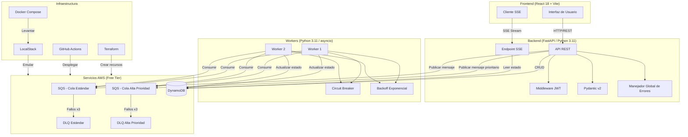
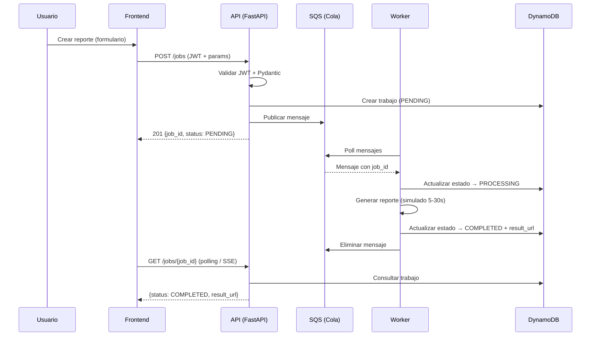
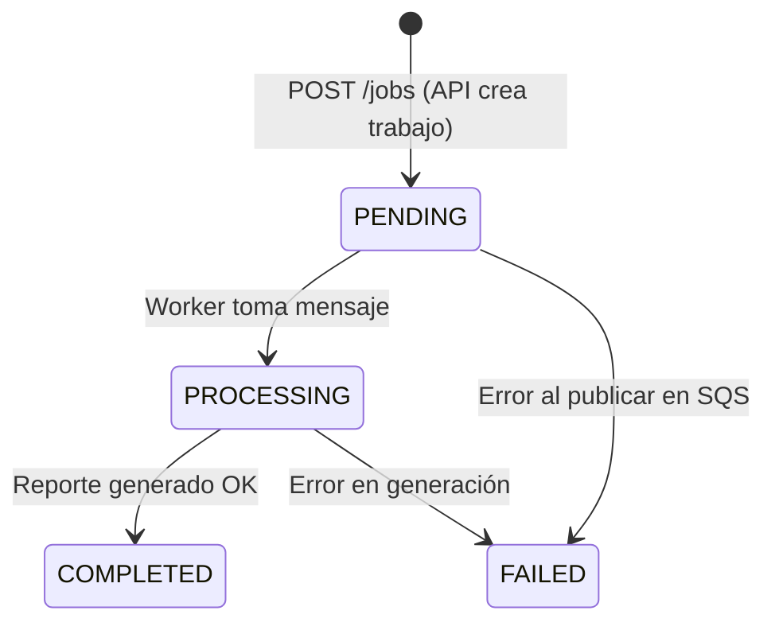

# Documentación Técnica — Sistema de Procesamiento Asíncrono de Reportes

## Diagrama de Arquitectura



## Flujo de Procesamiento



## Diagrama de Estados del Trabajo



## Servicios AWS Utilizados

| Servicio | Uso | Límite Free Tier | Uso Estimado |
|----------|-----|-----------------|--------------|
| **DynamoDB** | Persistencia de trabajos y usuarios | 25 GB, 25 RCU, 25 WCU | < 1 GB, < 5 RCU/WCU |
| **SQS** | Cola de mensajes (estándar + prioridad + DLQs) | 1M solicitudes/mes | < 10K solicitudes/mes |
| **EC2 (t2.micro)** | Cómputo para API + Worker + Frontend | 750 hrs/mes (12 meses) | 1 instancia 24/7 |
| **ECR** | Almacenamiento de imágenes Docker | 500 MB | < 200 MB |
| **CloudWatch** | Logs y métricas básicas | 10 métricas, 5 GB logs | Mínimo uso |

## Configuración de Colas SQS

| Cola | Visibility Timeout | Retención | Max Receives → DLQ |
|------|-------------------|-----------|---------------------|
| `reports-queue-standard` | 30s | 4 días | 3 |
| `reports-queue-high` | 30s | 4 días | 3 |
| `reports-dlq-standard` | 30s | 14 días | — |
| `reports-dlq-high` | 30s | 14 días | — |

## Modelo de Datos

### Tabla `jobs`

| Campo | Tipo | Descripción | Clave |
|-------|------|-------------|-------|
| `job_id` | String (UUID v4) | Identificador único del trabajo | Partition Key |
| `user_id` | String | ID del usuario propietario | GSI PK |
| `status` | String | PENDING, PROCESSING, COMPLETED, FAILED | — |
| `report_type` | String | sales, inventory, analytics | — |
| `format` | String | csv, pdf, json | — |
| `priority` | String | standard, high | — |
| `date_range` | Map | `{start_date, end_date}` | — |
| `created_at` | String (ISO 8601) | Fecha de creación | GSI SK |
| `updated_at` | String (ISO 8601) | Última actualización | — |
| `result_url` | String (nullable) | URL del reporte generado | — |
| `error_message` | String (nullable) | Mensaje de error | — |

**GSI `user-jobs-index`:** PK=`user_id`, SK=`created_at`, Proyección=ALL

### Tabla `users`

| Campo | Tipo | Descripción | Clave |
|-------|------|-------------|-------|
| `user_id` | String (UUID v4) | Identificador único | Partition Key |
| `username` | String | Nombre de usuario único | GSI PK |
| `password_hash` | String | Hash bcrypt | — |
| `created_at` | String (ISO 8601) | Fecha de registro | — |

**GSI `username-index`:** PK=`username`, Proyección=ALL

## Decisiones de Diseño

### 1. EC2 + Docker Compose para producción

**Decisión:** Usar una instancia EC2 t2.micro ejecutando Docker Compose con todos los servicios (API, Worker, Frontend/Nginx) en lugar de ECS Fargate o Lambda.

**Justificación:**
- Costos predecibles dentro del free tier (750 hrs/mes gratis por 12 meses)
- Simplicidad de despliegue (un solo `docker-compose up`)
- Sin cargos ocultos por tareas Fargate o invocaciones Lambda
- Suficiente para una aplicación de demostración/evaluación

**Trade-offs:**
- No escala horizontalmente de forma automática
- Single point of failure (una sola instancia)
- Requiere gestión manual de la instancia (actualizaciones de SO, etc.)

### 2. SQS con Dead Letter Queue

**Decisión:** Usar SQS estándar con DLQ configurada para 3 reintentos máximos.

**Justificación:**
- Resiliencia ante fallos transitorios (el mensaje se reintenta automáticamente)
- Los mensajes que fallan repetidamente van a la DLQ para análisis posterior
- Visibility timeout de 30s previene procesamiento duplicado
- Retención de 14 días en DLQ permite investigación sin presión

### 3. asyncio para concurrencia del Worker

**Decisión:** Usar `asyncio` nativo de Python para procesar múltiples mensajes en paralelo.

**Justificación:**
- Nativo en Python 3.11+, sin dependencias adicionales
- Ideal para operaciones I/O-bound (llamadas a DynamoDB, SQS)
- Menor overhead que threads o multiprocessing
- Configuración simple de concurrencia (semáforo con N slots)

### 4. JWT para autenticación stateless

**Decisión:** Tokens JWT firmados con HS256 y expiración configurable.

**Justificación:**
- No requiere almacenamiento de sesiones en servidor
- Compatible con arquitecturas distribuidas
- El token contiene toda la información necesaria (user_id, username, exp)
- Simple de implementar y verificar

### 5. SSE en lugar de WebSocket

**Decisión:** Server-Sent Events para notificaciones en tiempo real.

**Justificación:**
- Unidireccional (servidor → cliente), que es exactamente lo que necesitamos
- Funciona sobre HTTP estándar, sin upgrade de protocolo
- Reconexión automática nativa con `EventSource`
- Más simple de implementar y depurar que WebSocket
- Fallback a polling si SSE no está disponible

### 6. Terraform como IaC

**Decisión:** Terraform para toda la infraestructura de producción.

**Justificación:**
- Declarativo: describe el estado deseado, no los pasos
- Estado gestionado: sabe qué recursos existen y qué cambiar
- Amplio soporte para AWS con provider oficial
- Plan antes de aplicar: muestra cambios antes de ejecutarlos
- Comunidad activa y documentación extensa

### 7. LocalStack para desarrollo local

**Decisión:** LocalStack emulando SQS y DynamoDB para desarrollo sin costos.

**Justificación:**
- Un solo `docker compose up` levanta todo el entorno
- Sin costos de AWS durante desarrollo
- Comportamiento similar al real para SQS y DynamoDB
- Permite desarrollo offline
- Script de inicialización crea todos los recursos automáticamente

### 8. Pydantic v2 para validación

**Decisión:** Pydantic v2 para validación de todas las entradas del API.

**Justificación:**
- Integración nativa con FastAPI
- Validación declarativa con type hints
- Mensajes de error descriptivos automáticos
- Serialización/deserialización eficiente
- Model validators para reglas de negocio complejas (ej: date_range)

## Guía de Configuración de Producción

### Prerrequisitos

1. Cuenta AWS con acceso al free tier
2. AWS CLI configurado
3. Terraform instalado (v1.0+)
4. Par de claves SSH para EC2
5. Repositorio en GitHub con Actions habilitado

### Pasos de Despliegue

1. **Configurar secretos en GitHub:**
   - `AWS_ACCESS_KEY_ID` — Credenciales IAM
   - `AWS_SECRET_ACCESS_KEY` — Credenciales IAM
   - `EC2_HOST` — IP pública de la instancia EC2
   - `EC2_SSH_KEY` — Clave privada SSH
   - `JWT_SECRET` — Secreto para tokens JWT (generar con `openssl rand -hex 32`)
   - `REPO_URL` — URL del repositorio para clonar en EC2
   - `DYNAMODB_JOBS_TABLE` — Nombre de la tabla (default: `jobs`)
   - `DYNAMODB_USERS_TABLE` — Nombre de la tabla (default: `users`)
   - `SQS_STANDARD_QUEUE_URL` — URL de la cola SQS estándar
   - `SQS_HIGH_QUEUE_URL` — URL de la cola SQS de alta prioridad

2. **Crear infraestructura con Terraform:**
   ```bash
   cd infra/terraform
   terraform init
   terraform plan
   terraform apply
   ```

3. **El pipeline CI/CD despliega automáticamente** en cada push a `main`.

### Monitoreo

- **Health check:** `GET /health` retorna estado de DynamoDB y SQS
- **Logs:** Formato JSON estructurado con timestamp, level, message, request_id
- **Métricas:** Contadores de trabajos creados/completados/fallidos

## Stack Tecnológico

| Componente | Tecnología | Versión |
|------------|-----------|---------|
| Backend API | FastAPI + Uvicorn | 0.115.0 |
| Validación | Pydantic v2 | 2.9.2 |
| Autenticación | PyJWT + bcrypt | 2.9.0 / 4.2.0 |
| AWS SDK | boto3 | 1.35.19 |
| Worker | Python asyncio | 3.11+ |
| Frontend | React + TypeScript | 18.2+ |
| Build tool | Vite | 4.4+ |
| Containerización | Docker multi-stage | — |
| Orquestación local | Docker Compose | v2 |
| IaC | Terraform | 1.0+ |
| CI/CD | GitHub Actions | — |
| Dev local AWS | LocalStack | 3.0 |
| Testing (Python) | pytest + hypothesis | — |
| Testing (Frontend) | vitest + fast-check | — |
